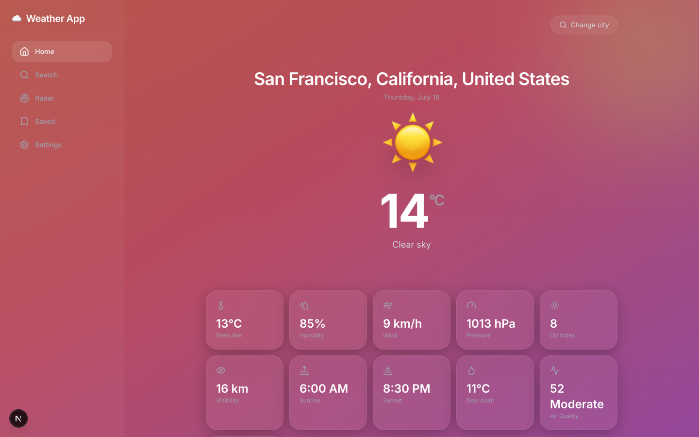
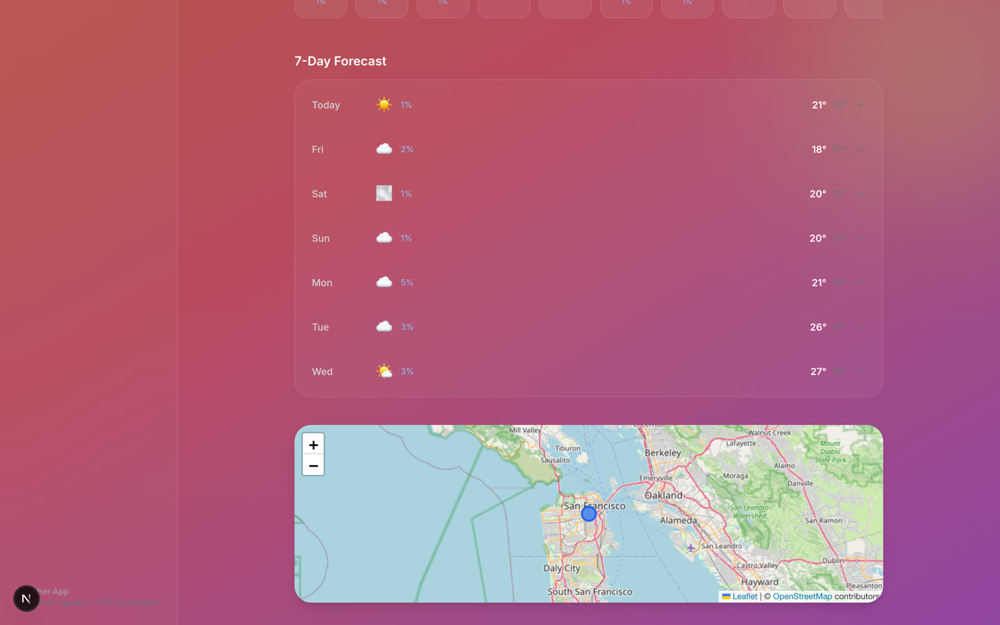
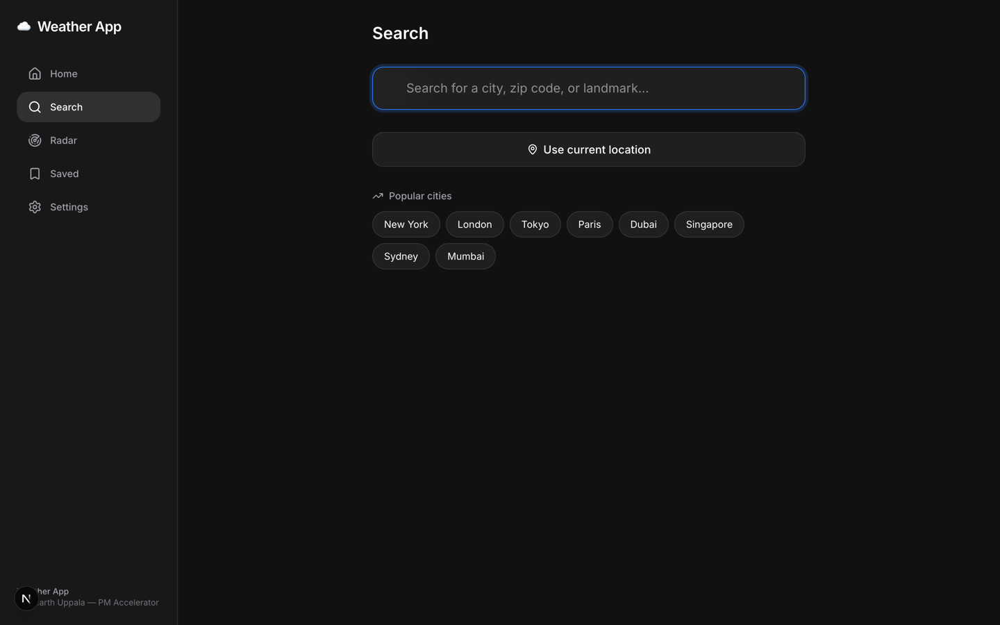
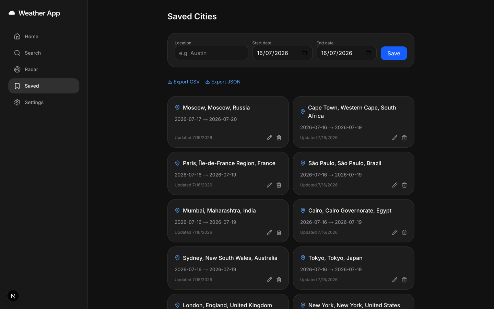
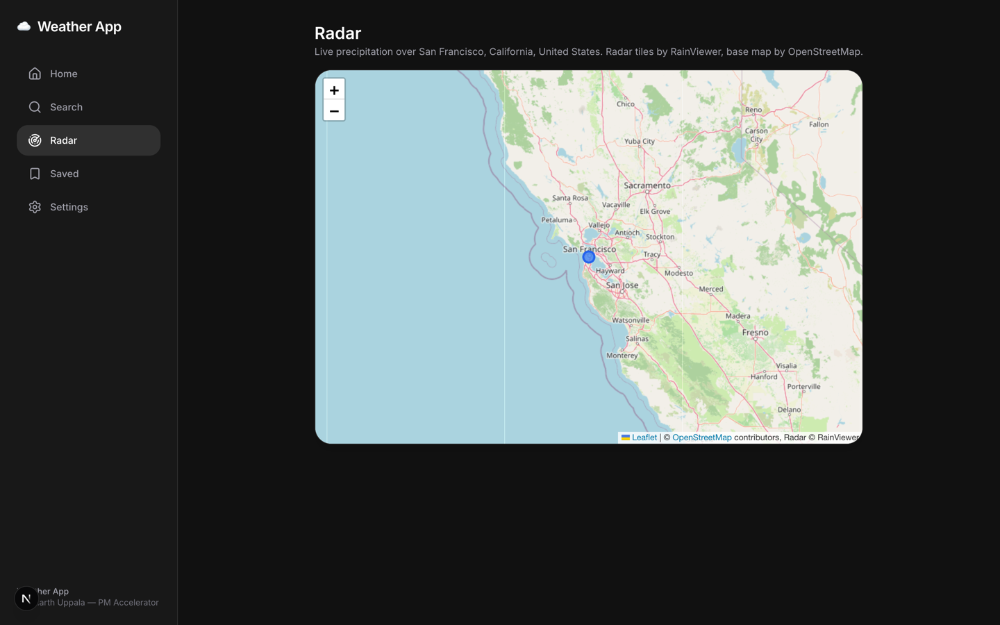
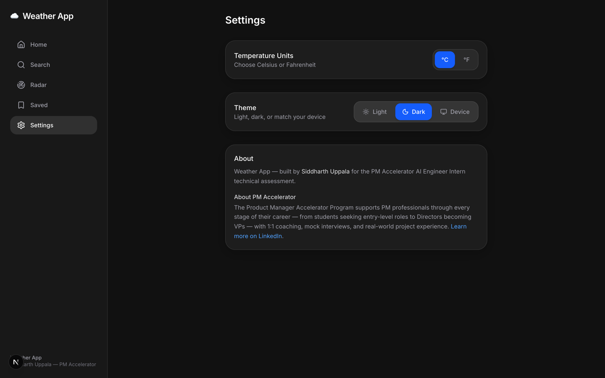
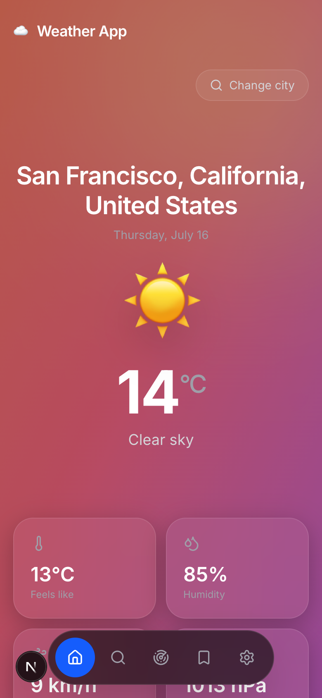
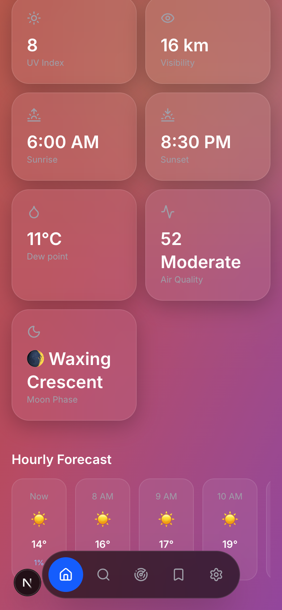

# Weather App — PM Accelerator 

Built by **Siddharth Uppala** for the PM Accelerator AI Engineer Intern technical assessment (Full Stack: Assessment #1 + #2).

**Live demo:** [pma-weather-app-eight.vercel.app](https://pma-weather-app-eight.vercel.app)

> Deployed on Vercel (serverless). The SQLite file backing Saved Cities lives in `/tmp`, so it
> persists while an instance stays warm but resets on a cold start — expected behavior on this
> hosting tier, not a bug. See [Getting started](#getting-started) to run it locally with normal
> persistence.

A weather app where users enter a location (city, zip, landmark, or their current GPS position)
and get real-time current conditions, a 5-day forecast, and a map — plus a backend that persists
location + date-range weather lookups with full CRUD and data export.

## Tech stack

- **Next.js 15 (App Router) + TypeScript + Tailwind CSS** — single project covers both the
  frontend (React-based, no Python/Java) and the backend (Next.js API routes act as the RESTful
  API layer).
- **Framer Motion + Lucide Icons** — page transitions, hover/press micro-interactions, animated
  temperature counter, and iconography for the premium UI.
- **Open-Meteo** — free, keyless weather + geocoding + air-quality API (current conditions, hourly
  and 7-day forecast, UV/pressure/dew point/sunrise/sunset, historical/forecast date ranges).
- **Nominatim (OpenStreetMap)** — free, keyless reverse geocoding for "use my location".
- **RainViewer** — free, keyless precipitation radar tiles for the Radar screen.
- **SQLite (better-sqlite3)** — zero-setup file-based persistence for the CRUD requirement.
- **Leaflet + OpenStreetMap tiles** — map of the resolved location (bonus API integration, no key
  needed).

No API keys or `.env` setup required — everything above is free and keyless.

## Getting started

```bash
npm install
npm run dev
```

Open [http://localhost:3000](http://localhost:3000). A `data.sqlite` file is created automatically
on first run.

## Demo video

[docs/demo/weather-app-demo.mp4](docs/demo/weather-app-demo.mp4) — ~55s walkthrough of every screen and the full
Saved Cities CRUD flow (create/update/delete + export).

## Screenshots

|  |  |
|---|---|
|  |  |
|  |  |
|  |  |

<p align="center">
  
  
</p>

## Screens

- **Home** (`/`) — location hero with animated temperature, weather-condition-driven gradient
  background (shifts color and adds rain/snow/stars/lightning per condition and day/night), quick
  stats (feels-like, humidity, wind, pressure, UV, visibility, sunrise/sunset, dew point, air
  quality, moon phase), 24-hour scroller, expandable 7-day forecast, and a map.
- **Search** (`/search`) — debounced geocode search, recent searches, popular cities, and GPS.
- **Saved** (`/saved`) — the backend CRUD screen (see below), restyled as cards.
- **Radar** (`/radar`) — Leaflet map with a live RainViewer precipitation overlay.
- **Settings** (`/settings`) — °C/°F unit toggle, Light/Dark/Device theme, and the About/PM
  Accelerator section.

Desktop gets a persistent sidebar nav; mobile gets a floating frosted bottom nav. Selected
location and unit preference persist across routes via localStorage-backed React context.

### Assessment #1 — Frontend

- Location search accepts city, zip/postal code, landmark, or coordinates (via Open-Meteo
  geocoding), plus a "📍 My location" button using the browser Geolocation API + reverse
  geocoding.
- Current conditions: temperature, feels-like, humidity, wind, and a weather icon.
- **5-day+ forecast** grid (`1.1`) — extended to a full 7 days with hourly detail too.
- **Error handling** (`1.2`): invalid/not-found locations, and upstream API failures, both surface
  a clear inline message instead of crashing.
- Responsive layout: sidebar + wide grid on desktop, single column with bottom nav on mobile;
  rearranges rather than just scaling.
- Map of the resolved location (Leaflet/OpenStreetMap, bonus `2.2`-style integration), plus a
  dedicated Radar screen with a live RainViewer precipitation layer.

### Assessment #2 — Backend

- **CRUD (`2.1`)** over a `searches` table (SQLite):
  - `POST /api/searches` — create: takes a location + date range, validates the date range
    (valid dates, start ≤ end, ≤92 days span), fuzzy-matches the location via geocoding, fetches
    weather for the range, and stores it.
  - `GET /api/searches` — read all saved searches (no row-level security, per the spec).
  - `PUT /api/searches/:id` — update the date range on an existing record (re-validated,
    re-fetches weather); location/coordinates are intentionally immutable on update — a new
    location is a new search.
  - `DELETE /api/searches/:id` — delete a record.
- **Data export (`2.3`)**: `GET /api/searches/export?format=csv|json`.
- Supporting endpoints: `GET /api/geocode?q=`, `GET /api/weather?lat=&lon=`,
  `GET /api/reverse-geocode?lat=&lon=`.

## Project structure

```
src/lib/weather.ts             # Open-Meteo + Nominatim client (geocoding, current/hourly/daily, air quality, moon phase)
src/lib/db.ts                  # SQLite schema + CRUD queries
src/lib/app-context.tsx        # Selected-location + unit preference, shared across routes via localStorage
src/app/api/**                 # REST API routes
src/app/{search,radar,saved,settings}/page.tsx  # Routes
src/components/AppShell.tsx    # Responsive sidebar (desktop) / bottom nav (mobile)
src/components/WeatherBackground.tsx  # Condition + day/night driven animated gradient
src/components/screens/*.tsx   # Per-route screen components
```
